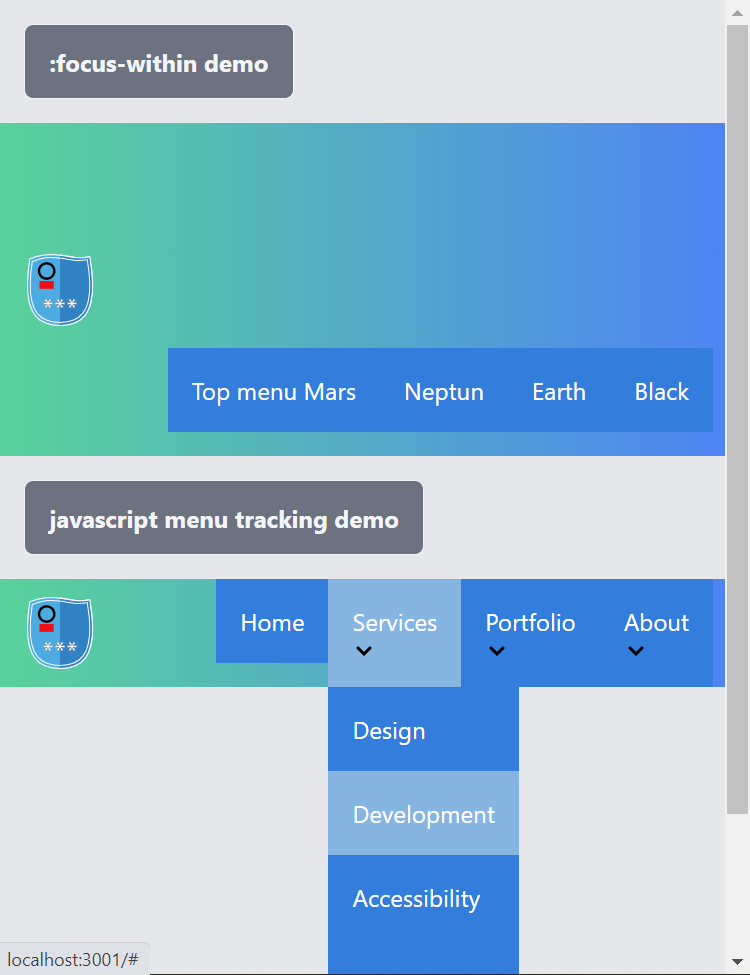

## About

Study project: Exploring UX of the menu interactions.

## Credits and References

* [caniusu :focus-within](https://caniuse.com/#feat=css-focus-within)
* [:focus-within](https://css-tricks.com/almanac/selectors/f/focus-within/)
* [Solved with CSS! Dropdown Menus](https://css-tricks.com/solved-with-css-dropdown-menus/)
* [In Praise of the Unambiguous Click Menu](https://css-tricks.com/in-praise-of-the-unambiguous-click-menu/)
* [The Clearfix](https://css-tricks.com/snippets/css/clear-fix/)
* [Closing on outside click](https://kittygiraudel.com/2021/03/18/close-on-outside-click/). [Demo](https://gorillas.io/en)